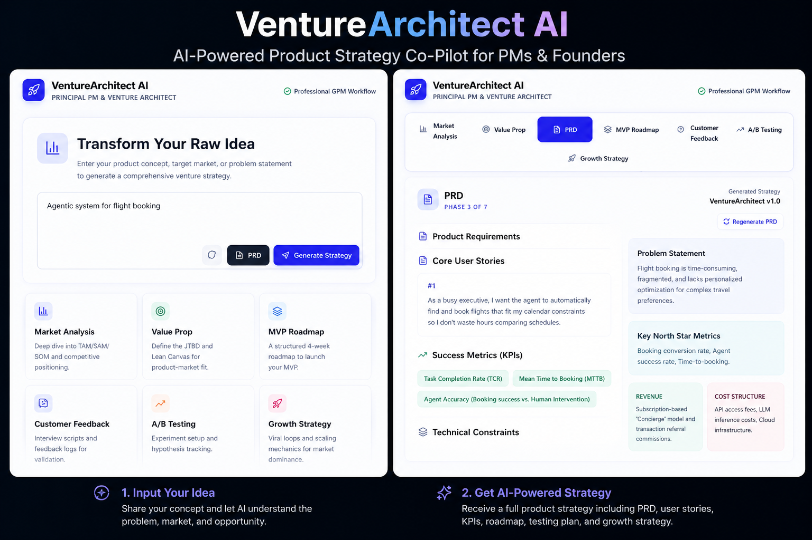
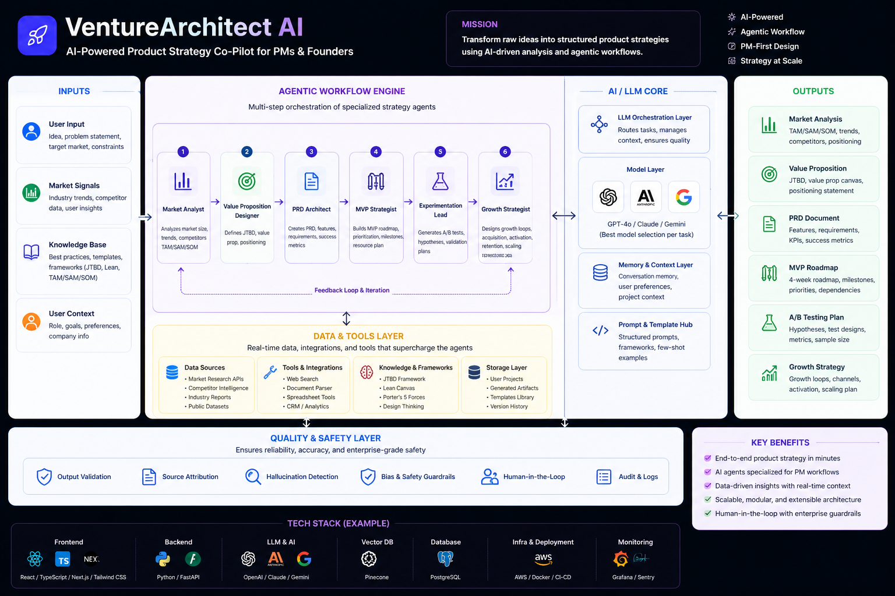

# VentureArchitect AI 🚀

An AI-powered Product Strategy Co-Pilot designed to help Product Managers, Founders, and Builders go from idea → execution.

---

## 🧠 What it does

VentureArchitect AI uses LLM-driven workflows to generate:

- 📊 Market Analysis (TAM/SAM/SOM, competition)
- 🎯 Value Proposition (JTBD + positioning)
- 🛣️ MVP Roadmap (structured launch plan)
- 💬 Customer Feedback Scripts
- 🧪 A/B Testing Plans
- 📈 Growth Strategy (loops + scaling mechanics)

---

## ⚙️ How it works

The system acts like a **multi-step AI agent workflow**:

1. User inputs idea / problem
2. AI processes structured prompts
3. Outputs modular strategy components
4. Combines them into a product blueprint

---

## 🧱 Architecture

- LLM (OpenAI / Claude / Gemini)
- Prompt-engineered workflows
- Modular output generation (strategy blocks)

- ,</> Markdown
- 
- 

Future Direction:
→ Multi-agent system (Researcher, Analyst, Strategist)
→ MCP-based tool integrations
→ Real-time market data 
